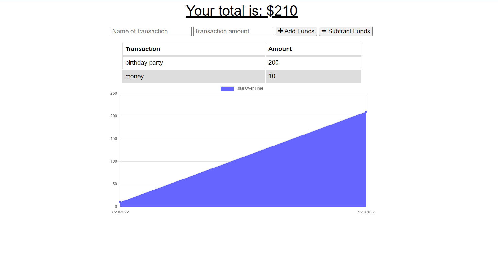
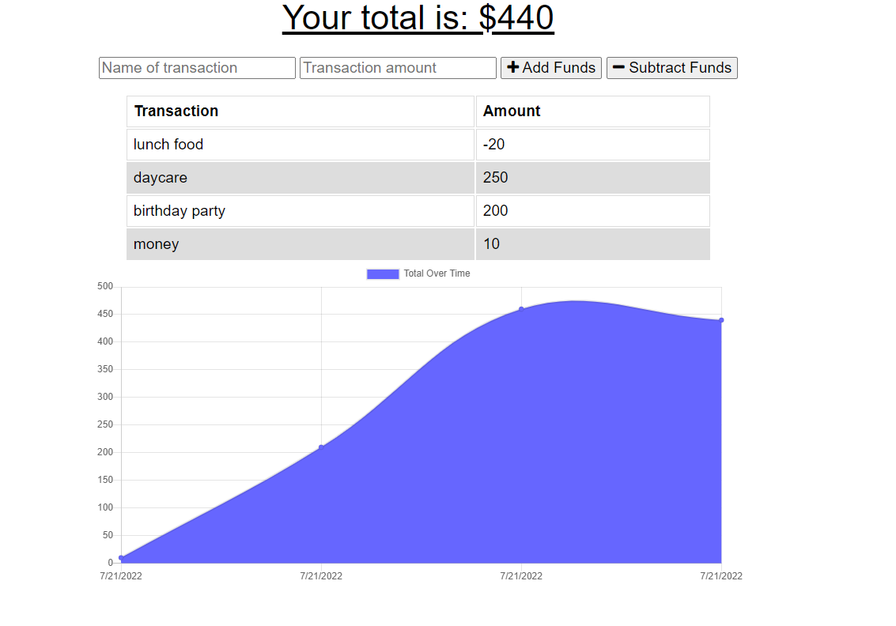

<h1 align="center">Budget Tracker 💸💹 </h1>

---

# Description

# Description

This application keep a record of your budget and display a graphical chart showing you how much money you have spend. You have the option to add and subtract to the budget. 

The app is to demonstrate service worker feature and using the browser indexDB to store the data. The server worker allow the user to continue working off-line and once their is connection the service worker will send the data to the server. The indexDB is use to store local data in the browser

# Table of Contents

[Installation](#installation)

[Usage](#usage)

[Technologies](#technologies)

[Contribution](#contribution)

[Tests](#test)

[Questions](#questions)

[License](#license)

# Installation

1. First have Node.js installed
2. clone the repo and in your terminal type `git clone https://github.com/SophoanMeas/budget-tracker`
3. type `npm i` to install all the node dependencies for this project
4. type `npm run start` to launch the application locally

# Usage
### Application

* <a href="https://budget-tracker-pon.herokuapp.com/" target="_blank"><h4> *Bugdget Tracker*</a>
# Technologies
Node Package Manager
* compress
* express.js
* mongoose - database storage
* nodemon - for running local server in dev
# Contribution

N/A

# Test

N/A
# Questions

---

<h1 align="center">Contact Me</h1>

Check out my Github for more projects

Have a question? Feel free to drop me an email.

📧[sophoan.meas@hotmail.com](mailto:sophoan.meas@hotmail.com)

---
# License

#### Copyright© [sophoanMeas](https://github.com/sophoanMeas). All rights reserved.
#### Licensed under *GNU*

---
## Screenshot

